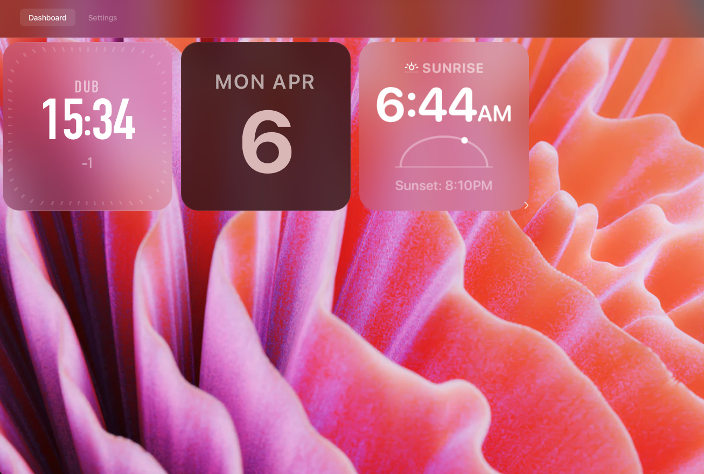

# Dashboard

A minimal, multi-device widget dashboard inspired by Apple and Dieter Rams design philosophy. Built with Flask and GridStack.



---

## Quick Start

```bash
pip install -r requirements.txt
python app.py
```

Open `http://localhost:5001` and follow the setup wizard to name your device and pick widgets.

---

## Multi-Device

Each browser that opens the dashboard registers as a separate device with its own name, widget layout, and settings. Devices are auto-named (e.g. `calm-sun`, `lunar-willow`). Switch between devices via `/switch/<device_id>`.

---

## Widgets

20 widgets included. Each lives in its own folder under `widgets/` with a single `data.js` file.

| Widget | Description |
|--------|-------------|
| `widget-apple-clock` | Digital clock with timezone, city code, UTC offset |
| `widget-apple-clock-analogue-dark` | Analog clock with numbered dial, dark theme |
| `widget-braun-clock` | Braun-styled analog clock with vintage dial and date |
| `widget-nothing-watch` | Nothing Phone–style watch face with dot grid |
| `widget-apple-pomodoro` | 25-minute pomodoro timer, click to start/stop |
| `widget-apple-calendar` | Current day, date, and month |
| `widget-apple-calendar-2` | Full month calendar grid |
| `widget-google-calendar` | Embedded Google Calendar iframe |
| `widget-apple-weather` | Temperature, conditions, high/low with icons |
| `widget-google-weather` | Hourly forecast grid (up to 12 hours) with rain % |
| `widget-google-weather-alerts` | Weather alert carousel with severity badge |
| `widget-google-wind` | Wind speed, gust, and direction with compass |
| `widget-apple-sunrise` | Sunrise/sunset times with animated sun arc |
| `widget-apple-bbc` | BBC News headlines with images and live indicator |
| `widget-ap-news` | AP News feed grouped by category (Live, World, Tech, Science) |
| `widget-kagi-news` | Kagi News in Instagram Stories format — full-bleed image, progress bars, tap to advance |
| `widget-apple-unsplashed` | Rotating Unsplash photography slideshow with locations |
| `widget-mondrian` | Procedural Mondrian-style art generator |
| `widget-apple-splash` | Splash/intro screen widget |

### Adding a Widget

Create a folder inside `widgets/` with a `data.js` file:

```
widgets/
  widget-my-thing/
    data.js
```

```javascript
module.exports = {
    "id": "widget-my-thing",
    "x": 0, "y": 0,
    "w": 2, "h": 2,
    "content": "<div class='my-widget'>Hello</div>",
    "css": "background: rgba(28,28,30,0.85); border-radius: min(28px, 8cqmin);"
};
```

| Field | Description |
|-------|-------------|
| `id` | Unique identifier, must match folder name |
| `x`, `y` | Default grid position (18-column grid) |
| `w`, `h` | Default grid size in columns/rows |
| `content` | Raw HTML rendered inside the widget |
| `css` | Inline CSS applied to the widget container |
| `lock_ratio` | `true` to enforce aspect ratio on resize |
| `refresh_interval` | Seconds between data refreshes |
| `categories` | Kagi News: comma-separated category list |
| `levels` / `stroke` / `split_ratio` | Mondrian generator controls |
| `lat`, `lng`, `timezone`, `city` | Location-aware widgets |

### Responsive Sizing

Use `cqmin` units — they scale proportionally as the widget is resized:

```css
.my-widget {
    font-size: 12cqmin;
    padding: 5cqmin;
}
```

---

## Settings

Access via the gear icon in the dashboard header.

### Background

- **Gradient presets** — 18 dark gradient themes with color swatches
- **Custom CSS** — any valid CSS `background` value
- **Wallpaper gallery** — browse, search, and apply with size / position / blur / dim controls

### Live Wallpapers (Aerial)

199 Apple TV aerial videos available as animated backgrounds. Videos are downloaded on demand and stored locally.

- Browse and search all 199 aerials by name
- Click **Download** to fetch a video in the background — progress tracked live
- Click **Set** once downloaded to apply instantly (no page reload)
- Click **Refresh List** to pull the latest catalog from the source repository
- Requires [ffmpeg](https://ffmpeg.org/) (`brew install ffmpeg`) for cross-platform playback — new downloads remux automatically from QuickTime container to standard MPEG-4

Downloaded videos are stored in `static/aerials/` as `.mp4` files.

### Widget Style Editor

Per-widget controls:

- **Theme presets** — Dark, Light, Glass, Frost, Noir, Warm, and more
- **Color, opacity, blur, radius, border, shadow, font** — individual sliders and pickers
- **Refresh interval** — configurable per widget
- **Raw CSS editor** — full override for power users

### Widget-Specific Settings

| Widget | Settings |
|--------|----------|
| Mondrian | Levels (complexity), Stroke width, Grid Detail (Coarse / Medium / Fine) |
| Kagi News | Category checkboxes (41 available: world, tech, ai, science, business, sports, …) |
| Google Weather | Hours to show (1–12) |
| Location widgets | City / coordinates picker with search autocomplete |

### Default Location

Set once and shared by weather, wind, alerts, and sunrise widgets.

---

## Wallpapers

Drop images (`.png`, `.jpg`, `.jpeg`, `.webp`, `.gif`, `.svg`) into `static/wallpapers/`. They appear automatically in Settings with auto-generated thumbnail previews and a search filter.

---

## API Reference

### Pages

| Route | Description |
|-------|-------------|
| `GET /` | Redirect to dashboard or setup |
| `GET /dashboard` | Main dashboard |
| `GET/POST /settings` | Settings page |
| `GET/POST /setup` | Device setup wizard (step 1) |
| `GET/POST /setup/widgets` | Widget picker (step 2) |
| `GET /switch/<device_id>` | Switch active device |

### Settings Actions (POST `/settings`)

| `action` | Description |
|----------|-------------|
| `update_widget` | Save widget CSS + per-widget config |
| `update_background` | Save background CSS, blur, dim, or `bg_video` |
| `update_default_location` | Save lat/lng/city/timezone |
| `remove_widget` | Remove widget from device layout |
| `add_widget` | Add widget to device layout |

### Data APIs

| Route | Description |
|-------|-------------|
| `GET /api/wallpapers` | List wallpaper images |
| `GET /api/thumb/<file>` | Auto-generated thumbnail |
| `GET /api/bbc_news` | BBC News headlines |
| `GET /api/ap_news` | AP News headlines (grouped by category) |
| `GET /api/kagi_stories?categories=tech,ai` | Kagi News stories for given categories |
| `GET /api/google_weather_alerts?lat=&lng=` | Active weather alerts |
| `GET /api/google_wind?lat=&lng=` | Current wind conditions |
| `GET /api/google_cal_url` | Google Calendar embed URL |
| `GET /api/cities?q=` | City search autocomplete |
| `GET /api/timezone?lat=&lng=` | IANA timezone lookup |
| `POST /api/update_layout` | Persist widget grid positions |

### Aerial APIs

| Route | Description |
|-------|-------------|
| `GET /api/aerials` | List catalog with per-video download status |
| `POST /api/aerials/download` | Start background download `{id}` |
| `GET /api/aerials/status?id=` | Poll download progress |
| `POST /api/aerials/delete` | Delete downloaded video `{id}` |
| `POST /api/aerials/refresh` | Re-fetch catalog from GitHub |

---

## Architecture

```
app.py                    Flask server, all API routes, business logic
db.py                     SQLite helpers (devices, config, widgets)
dashboard.db              SQLite database (auto-generated)
aerial_catalog.json       199 Apple aerial video entries (id, name, urls)

templates/
  dashboard.html          GridStack grid + video background
  settings.html           Full settings UI
  setup.html              Device type picker
  setup_widgets.html      Widget + location setup

static/
  styles.css              Global design system
  main.js                 GridStack init, layout persistence
  wallpapers/             Drop wallpaper images here
  aerials/                Downloaded aerial .mp4 files
  fonts/                  SF Pro, SF Rounded, Ndot-55
  Icons/                  favicon.png, settings.svg, device icons

widgets/
  widget-*/
    data.js               Widget definition (HTML, CSS, JS, defaults)
```

### Database Schema

**`devices`** — one row per registered device  
`id`, `name`, `type` (laptop / tablet), `created_at`

**`device_config`** — key/value config per device  
`device_id`, `key`, `value`  
Keys: `background`, `bg_blur`, `bg_dim`, `bg_video`, `default_lat`, `default_lng`, `default_city`, `default_timezone`

**`device_widgets`** — widget layout per device  
`device_id`, `widget_id`, `x`, `y`, `w`, `h`, `css`, `extra` (JSON blob for widget-specific fields)

---

## Requirements

- Python 3.9+
- `pip install -r requirements.txt`
- [ffmpeg](https://ffmpeg.org/) — optional, required for aerial video cross-platform compatibility (`brew install ffmpeg`)

---

## License

MIT
